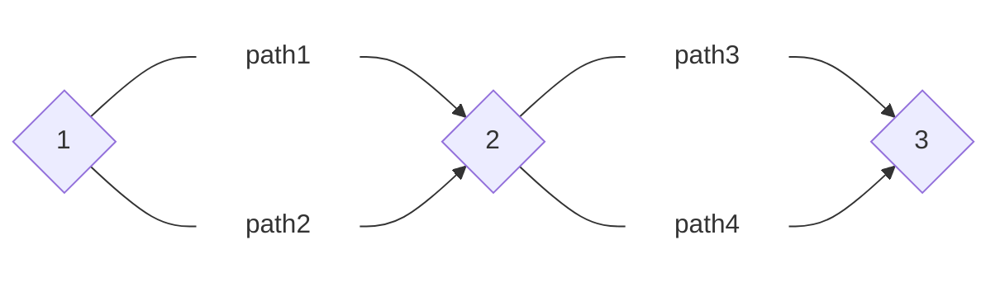

# <center>[Graph Theory 1](https://github.com/Yee172/Graph_Theory_Totorial/blob/master/tutorial/raw/Graph_Theory_1.md)</center>

## 0.Warm up

### 0.1 Mind-blowing

#### 0.1.1 State problem

[Description]</br>
Etéreo is always curious about the mystery of numbers. This time, he wrote $N^{2}$ numbers from $1$ to $N^{2}$ on the paper, and arranged these numbers into a matrix of $N \times N$. He was surprised to find that the sum of the numbers in each row, column, and two main diagonals in this square is not the same. He wants more squares, but he can't write it again. So he rushed to come to you and ask you to give him a square array with $N$ on the side that satisfies the above nature.

[Input]</br>
Enter a total of one line, an integer $N$ $(3 \leqslant N \leqslant 1000)$.

[Output]</br>
Output a total of $N$ lines, each line of $N$ integers, representing the answer matrix.
Output any feasible solution.

[Sample]
| Input          | Output                            |
| -------------- | --------------------------------- |
| 3<br /> <br /> | 1  2  3<br />8  9  4<br />7  6  5 |

#### 0.1.2 Standard solution

Python3:

```python
n = int(input())
for i in range(n):
    r = []
    for j in range(1, n):
        r.append((n - 1) * i + j)
    r.append(n * n - n + 1 + i)
    print(*r)
```

#### 0.1.3 Monkey solution

##### 0.1.3.1 A brief introduction of Monkey Sort

- Infinite monkey theorem

  The infinite monkey theorem states that a monkey hitting keys at random on a typewriter keyboard for an infinite amount of time will almost surely type a given text, such as the complete works of William Shakespeare.


- Monkey sort also as known as **bogo sort**, permutation sort, stupid sort, slow sort, shotgun sort
- Time and space complexity

$$
\begin{align}
\left \{ \begin{matrix}
\begin{split}
&\text{Best-case time complexity} &\quad : &\quad O(n)\\
&\text{Average time complexity} &\quad : &\quad O((n + 1)!)\\
&\text{Worst-case time complexity} &\quad : &\quad O(\infty)\\[3ex]

&\text{Best-case space complexity} &\quad : &\quad O(n)\\
&\text{Average space complexity} &\quad : &\quad O(n)\\
&\text{Worst-case space complexity} &\quad : &\quad O(n)
\end{split}
\end{matrix} \right .
\end{align}
$$

- Sample code

  Python3:

  ```python
  import random
  # aim to get the not descending ordered data
  def is_sorted(data):
  	for i in range(len(data) - 1):
  		if data[i] > data[i + 1]:
  			return False
  	return True

  def monkey_sort(data):
  	while not is_sorted(data):
  		random.shuffle(data)
  ```


- [For more details](https://en.wikipedia.org/wiki/Bogosort)

##### 0.1.3.2 The fitness of this solution

Assume we get a $N \times N$ matrix, consider the order of magnitude, we can easily see that
$$
\begin{align}
\left \{ \begin{matrix}
\begin{split}
&\text{#\{ the sum of the numbers in each row, column, and two main diagonals \}} &= 2N + 2\\[2ex]
&\text{#\{ the possible sum of $N$ distinct numbers \}} = \left ( \sum_{i = N^{2} - N + 1}^{N^2} i \right ) - \left ( \sum_{i = 1}^{N} i \right ) + 1 &= N^{3} - N^{2} + 1
\end{split}
\end{matrix} \right .
\end{align}
$$
Thus, the larger $N$ we have, the more possible that a random matrix satisfies the nature.

##### 0.1.3.3 The application of the monkey sort

1. Find all the corresponding seeds that can successfully construct the matrix we want for every input $N$

   Python3:

   ```python
   # filename = Generate.py
   import random
   import sys

   def isgood(a, n):
       m = set()
       for i in range(0, n * n, n):
           new = sum(a[i:i + n])
           if new in m:
               return 0
           m.add(new)
       for i in range(n):
           new = sum(a[i::n])
           if new in m:
               return 0
           m.add(new)
       new = sum(a[n * i + i] for i in range(n))
       if new in m:
           return 0
       m.add(new)
       new = sum(a[n * i + n - 1 - i] for i in range(n))
       if new in m:
           return 0
       return 1

   def create(n):
       a = [i + 1 for i in range(n * n)]
       random.shuffle(a)
       return a

   N = 3
   while N < 1001:
       i = 2333
       while 1:
           random.seed(i)
           if isgood(create(N), N):
               print('N: %03d  |  seed: %d' %(N, i - 2333))
               print('N: %03d  |  seed: %d' %(N, i - 2333), file=sys.stderr)
               break
           i += 1
       N += 1
   ```

   Shell:

   ```shell
   # filename = get_seed.sh
   folderpath=$(cd `dirname $0`; pwd)
   cd $folderpath
   python3 Generate.py > seeds.txt
   ```

2. Use seeds just found to write the solution

   Python3:

   ```python
   import random
   x = [[],
        [5, 7, 9, 10, 12, 13, 14, 17, 32, 42, 43, 44, 54, 66, 70, 80, 90, 91, 95, 115,
         122, 133, 144, 152, 160, 162, 174, 188, 191, 193, 209, 210, 216, 226, 236, 247,
         255, 269, 270, 281, 291, 294, 314, 326, 328, 353, 362, 400, 405, 408, 414, 418,
         431, 439, 441, 442, 455, 459, 471, 472, 492, 504, 519, 522, 525, 541, 566, 580,
         585, 598, 620, 623, 634, 646, 651, 661, 673, 715, 717, 771, 781, 786, 795, 802,
         860, 865, 873, 883, 903, 914, 923, 960, 989, 991],
        [11, 40, 64, 74, 75, 82, 109, 112, 124, 259, 346, 529, 850],
        [24, 132, 175]]
   n = int(input())
   s = 0
   for _ in range(4):
       if n in x[_]:
           s = _
   random.seed(s + 2333)
   m = [i for i in range(1, n * n + 1)]
   random.shuffle(m)
   print('\n'.join(' '.join(map(str, m[x: x + n])) for x in range(0, n * n, n)))
   ```

### 0.2 Extension (Other weird sort algorithm)

#### 0.2.1 Sleep sort

In general, sleep sort works by starting a separate task for each item to be sorted, where each task sleeps for an interval corresponding to the item's sort key, then emits the item. Items are then collected sequentially in time.

[Codes portal](https://rosettacode.org/wiki/Sorting_algorithms/Sleep_sort)

#### 0.2.2 Spaghetti Sort

A) Put a table in the kitchen (an horizontal segment in the box)</br>
B) Hold the spaghetti over the table (a sequence of vertical segments across the hand segment)</br>
C) Let them fall on the table (here gravity + the table do some magic)</br>
D) Start move the hand downward</br>
E) When hand touches a spaghetto, picks it up, and moves it on the left</br>
F) Repeat D-E until the hand touches the table


####0.2.3 Calling-a-stag-a-horse sort

A) Gather a bunch of people and show them your array</br>
B) Ask them if this array is sorted</br>
C) Remove people who think they are not sorted</br>
D) Repeat B-C until everyone agrees that this array is sorted well

---

## 1.Preliminary Knowledge

### 1.1 Basic data structure


#### 1.1.1 Stack

A stack is a container of objects that are inserted and removed according to the **last-in first-out (LIFO)** principle.</br>
In the stack only two operations are allowed:

1. **push** the item into the stack (adds an item to the top of the stack)
2. **pop** the item out of the stack (removes the item from the top)

A helpful analogy is to think of a stack of books, you can remove only the top book or add a new book on the top.


#### 1.1.2 Queue

A stack is a container of objects that are inserted and removed according to the **first-in first-out (FIFO)** principle.</br>
In the queue only two operations are allowed:

1. **enqueue** (insert an item into the back of the queue)
2. **dequeue** (remove the front item)

A helpful analogy is to think that a person getting into line is enqueued, and a person getting out of line is dequeued.


#### 1.1.3 Relation between stack and queue (optional)

A queue can be implemented by two stacks.</br>
[For more details](https://stackoverflow.com/questions/69192/how-to-implement-a-queue-using-two-stacks)

A stack can be implemented by two queues.</br>
[For more details](https://stackoverflow.com/questions/688276/implement-stack-using-two-queues)

### 1.2 Basic cpp operations

There's too many operations, if you are not familiar with the operations that the following parts mentioned, please search by yourself.</br>
[Search](http://en.cppreference.com/w/cpp)

### 1.3 Greedy algorithm

A greedy algorithm is an algorithmic paradigm that follows the problem solving heuristic of making the **locally optimal choice** at each stage with the hope of finding a **global optimum**.</br>
In many problems, a greedy strategy does not in general produce an optimal solution, but nonetheless a greedy heuristic may yield locally optimal solutions that approximate a global optimal solution in a reasonable time.</br>
[cite from wikipedia, click here for more details](https://en.wikipedia.org/wiki/Greedy_algorithm)

### 1.4 Dynamic programming

Dynamic programming (also known as dynamic optimization) is a method for solving a complex problem by breaking it down into a collection of **simpler subproblems**, solving each of those subproblems just once, and **storing their solutions**.</br>
The next time the same subproblem occurs, instead of recomputing its solution, one simply looks up the previously computed solution, thereby saving computation time at the expense of (it is hoped) a modest expenditure in storage space.</br>
[cite from wikipedia, click here for more details](https://en.wikipedia.org/wiki/Dynamic_programming)

### 1.5 Two types of graphs

#### 1.5.1 Undirected graphs


#### 1.5.2 Directed graphs 


### 1.6 Graph traversal algorithms


#### 1.6.1 Depth-First Search (DFS)

Depth-First Search with a Stack

In depth-first search we go down a path until we get to a dead end; then we backtrack or back up (by popping a stack) to get an alternative path.

- Create a stack
- Create a new choice point
- Push the choice point onto the stack
- while (not found and stack is not empty)
  - Pop the stack
  - Find all possible choices after the last one tried
  - Push these choices onto the stack
- Return

Pseudocode:

```pseudocode
procedure DFS(G, v):
    label v as explored
    for all edges e in G.incidentEdges(v) do
        if edge e is unexplored then
            w ← G.adjacentVertex(v, e)
            if vertex w is unexplored then
                label e as a discovered edge
                recursively call DFS(G, w)
            else
                label e as a back edge
```

[Demo from stanford](https://cs.stanford.edu/people/abisee/tutorial/dfs.html)

####1.6.2 Breadth-First Search (BFS)

Breadth-First Search with a Queue

In breadth-first search we explore all the nearest possibilities by finding all possible successors and enqueue them to a queue.

- Create a queue
- Create a new choice point
- Enqueue the choice point onto the queue
- while (not found and queue is not empty)
  - Dequeue the queue
  - Find all possible choices after the last one tried
  - Enqueue these choices onto the queue
- Return

Pseudocode:

```pseudocode
procedure BFS(G, v):
    create a queue Q
    enqueue v onto Q
    mark v
    while Q is not empty:
        t ← Q.dequeue()
        if t is what we are looking for:
            return t
        for all edges e in G.adjacentEdges(t) do
            o ← G.adjacentVertex(t, e)
            if o is not marked:
                mark o
                enqueue o onto Q
    return null
```

[Demo from stanford](https://cs.stanford.edu/people/abisee/tutorial/bfs.html)

---

## 2.Representations of graphs

### 2.1 Notations

$$
G(V, E) \to \text{Graph}\\
V \to \text{Vertices}\\
E \to \text{Edges}\\
(u, v) \to \text{Edge from $u$ to $v$}\\
\text{$(u, v)$ is the outgoing edge for $u$}\\
\text{$(u, v)$ is the incoming edge for $v$}\\
\deg(v) \to \text{the degree of $v$, i.e. number of edges associated with vertex $v$}\\
\deg_{+}(v) \to \text{the indegree of $v$, i.e. number of incoming edges associated with vertex $v$}\\
\deg_{-}(v) \to \text{the outdegree of $v$, i.e. number of outgoing edges associated with vertex $v$}
$$

### 2.2 Adjacency matrix and adjacency list


$$
\begin{align}
(b) &\to \text{Adjacency matrix}\\
(c) &\to \text{Adjacency list}
\end{align}
$$
An example of applications of adjacency matrix - **count the number of paths**



Let $A$ be the adjacent matrix of this graph, we have
$$
\begin{align}
A =
\left ( \begin{matrix}
0 &2 &0\\
0 &0 &2\\
0 &0 &0
\end{matrix} \right ), \qquad
A^{2} =
\left ( \begin{matrix}
0 &0 &4\\
0 &0 &0\\
0 &0 &0
\end{matrix} \right ), \qquad
A + A^{2} =
\left ( \begin{matrix}
0 &2 &4\\
0 &0 &2\\
0 &0 &0
\end{matrix} \right )
\end{align}
$$
which imples that there are $2$ distinct paths from vertex $1$ to vertex $2$, $2$ distinct paths from vertex $2$ to vertex $3$, $4$ distinct paths from vertex $1$ to vertex $3$.

###2.3 Normal attributes of vertex and edge

As mentioned, the most used attributes of vertex in simple graph is the **degree** of vertex or **indegree** of vertex and **outdegree** of vertex.

At most time, we use index to represent a vertex.

And at most time, we claim an edge like this:

```cpp
struct edge
{
    int u; // vertex from
    int v; // vertex to
    int w; // weight of edge
};
```

---

## 3.Introduction to the shortest path question

In graph theory, the shortest path problem is the problem of finding a path between two vertices in a graph such that the sum of the weights of its constituent edges is minimized.

The most important algorithms for solving this problem are:

- [Dijkstra's algorithm](https://en.wikipedia.org/wiki/Dijkstra%27s_algorithm) solves the single-source shortest path problem with non-negative edge weight.
- [Floyd–Warshall algorithm](https://en.wikipedia.org/wiki/Floyd%E2%80%93Warshall_algorithm) solves all pairs shortest paths.
- [Bellman–Ford algorithm](https://en.wikipedia.org/wiki/Bellman%E2%80%93Ford_algorithm) solves the single-source problem if edge weights may be negative.
- [A* search algorithm](https://en.wikipedia.org/wiki/A*_search_algorithm) solves for single pair shortest path using heuristics to try to speed up the search.
- [Johnson's algorithm](https://en.wikipedia.org/wiki/Johnson%27s_algorithm) solves all pairs shortest paths, and may be faster than Floyd–Warshall on sparse graphs.
- [Viterbi algorithm](https://en.wikipedia.org/wiki/Viterbi_algorithm) solves the shortest stochastic path problem with an additional probabilistic weight on each node.

Basicly, problems can be classified as
$$
\begin{align}
\text{Nonnegative weights} &\leftrightarrow \text{Arbitrary weights}\\
\text{Single source} &\leftrightarrow \text{All pairs}\\
\text{Directed graphs} &\leftrightarrow \text{Undirected graphs}\\
\text{Weighted graphs} &\leftrightarrow \text{Unweighted graphs}\\
\end{align}
$$
[cite from wikipedia, click here for more details](https://en.wikipedia.org/wiki/Shortest_path_problem#Strategic_shortest-paths)

---

## 4.Shortest path algorithms

### 4.0 Initialization

```cpp
#include <bits/stdc++.h>
using namespace std;
const int N = 100500;
const int M = 100500;
const static int inf = 0x3f3f3f3f;

struct edge
{
    int u;
    int v;
    int w;
};
vector<edge> e[N]; // using adjacency list

inline void insert_edge(int u, int v, int w)
{
    e[u].push_back(edge{u, v, w});
}

inline void insert_double_edge(int u, int v, int w)
{
    insert_edge(u, v, w);
    insert_edge(v, u, w);
}

// Read in your graph by the previous functions
```

### 4.1 Dijkstra's Algorithm


$$
\text{dij $=$ BFS $\cup$ DP $\cup$ Greedy}
$$

```cpp
bool visited[N];
int distance[N];
int dij(int start, int total, int end)
{
    for (int i = 1; i <= total; i++)
    {
        distance[i] = inf;
        visited[i] = false;
    }
    priority_queue<pair<int, int> > q;
    q.push(make_pair(distance[start] = 0, start));
    while (!q.empty())
    {
        int u = q.top().second;
        q.pop();
        if (visited[u]) continue;
        visited[u] = true;
        for (int i = 0; i < e[u].size(); i++)
        {
            int v = e[u][i].v;
            int w = e[u][i].w;
            if (distance[v] > distance[u] + w)
            {
                distance[v] = distance[u] + w;
                q.push(make_pair(- distance[v], v));
            }
        }
    }
    return distance[end];
}
```

$$
\text{Time complexity} \quad : \quad O(|E| \log |V|)\\
$$

### 4.2 Floyd Algorithm (Floyd-Warshall Algorithm) 

$$
\text{Floyd $=$ DP $\cup$ Enumeration}
$$

```cpp
int dp[N][N];
void floyd(int total)
{
    for (int k = 1; k <= total; k++)
        for (int i = 1; i <= total; i++)
            for (int j = 1; j <= total; j++)
                dp[i][j] = min(dp[i][j], dp[i][k] + dp[k][j]);
}
```

$$
\begin{align}
\left \{ \begin{matrix}
\begin{split}
&\text{Best-case time complexity} &\quad : &\quad O(|V|^{3})\\
&\text{Average time complexity} &\quad : &\quad O(|V|^{3})\\
&\text{Worst-case time complexity} &\quad : &\quad O(|V|^{3})\\
\end{split}
\end{matrix} \right .
\end{align}
$$

### 4.3 Bellman-Ford algorithm

$$
\text{Bellman-Ford $=$ DP $\cup$ Brute force}
$$

```cpp
// Judge the negative cycle
int distance[N];
bool bellman_ford(int start, int total)
{
    for (int i = 1; i <= total; ++i)
    {
        distance[i] = inf;
    }
    distance[start] = 0;
    for (int t = 1; t <= total; t++)
        for (int u = 1; u <= total; u++)
            for (int i = 0; i < e[u].size(); i++)
            {
                int v = e[u][i].v;
                int w = e[u][i].w;
                if (distance[v] > distance[u] + w)
                    distance[v] = distance[u] + w;
            }
    for (int u = 1; u <= total; u++)
        for (int i = 0; i < e[u].size(); i++)
        {
            int v = e[u][i].v;
            int w = e[u][i].w;
            if (distance[v] > distance[u] + w) return true;
        }
    return false;
}
```

$$
\begin{align}
\left \{ \begin{matrix}
\begin{split}
&\text{Best-case time complexity} &\quad : &\quad O(|V||E|)\\
&\text{Average time complexity} &\quad : &\quad O(|V||E|)\\
&\text{Worst-case time complexity} &\quad : &\quad O(|V||E|)\\
\end{split}
\end{matrix} \right .
\end{align}
$$

### 4.4 SPFA (Shortest Path Faster Algorithm)

$$
\text{SPFA $=$ Bellman-Ford $\cup$ Queue}\\
\text{SPFA $=$ BFS $\cup$ DP}
$$

```cpp
// Judge the negative cycle
int visited[N];
int distance[N];
bool spfa(int start, int total)
{
    queue<int> q;
    for (int i = 1; i <= total; ++i)
    {
        distance[i] = inf;
        visited[i] = 0;
    }
    q.push(start);
    distance[start] = 0;
    while (!q.empty())
    {
        int u = q.front();
        q.pop();
        for (int i = 0; i < e[u].size(); i++)
        {
            int v = e[u][i].v;
            int w = e[u][i].w;
            if (distance[v] > distance[u] + w)
            {
                distance[v] = distance[u] + w;
                visited[v]++;
                if (visited[v] > total) return true;
                q.push(v);
            }
        }
    }
    if (distance[start] < 0) return true;
    return false;
}
```

$$
\begin{align}
&\left \{ \begin{matrix}
\begin{split}
&\text{Best-case time complexity} &\quad : &\quad O(2 |V|)\\
&\text{Average time complexity} &\quad : &\quad O(K |E|)\\
&\text{Worst-case time complexity} &\quad : &\quad O(|V||E|)\\
\end{split}
\end{matrix} \right .\\
&\text{, where $K$ is determined by the condition of  graph, normally $\leqslant 2$}
\end{align}
$$

---

## 5.Applications

### 5.1 Location analysis


One student from each of $4$ cities conveniently numbered from $1$ to $4$ is going to attend the big party to be held at city $2$.</br>
Each student must walk to the party and, when the party is over, return back home.</br>
Each student is lazy and thus picks an optimal route with the shortest time.</br>
Of all the students, what is the longest amount of time a student must spend walking to the party and back?</br>
[Original question](http://poj.org/problem?id=3268)

### 5.2 Arbitrage


### 5.3 System of difference constraints 

A set of inequalities of the form $x_{i} - x_{j} \leqslant b_{i, j}$ is called a system of difference constraints.</br>
You have a system of difference constraints:
$$
\begin{align}
x_{1} - x_{2} &\leqslant 0\\
x_{1} - x_{5} &\leqslant -1\\
x_{2} - x_{5} &\leqslant 1\\
x_{3} - x_{1} &\leqslant 5\\
x_{4} - x_{1} &\leqslant 4\\
x_{4} - x_{3} &\leqslant -1\\
x_{5} - x_{3} &\leqslant -3\\
x_{5} - x_{4} &\leqslant -3\\
\end{align}
$$
You want to know whether there exists some $b$ such that satisfies $x_{5} - x_{1} \leqslant b$, if exists, what is the minimum value of $b$.

### 5.4 Determine the whether ranks can be determined 

$5$ students ($A$, $B$, $C$, $D$, $E$) are participating in a modeling contest.</br>
Each student has a certain constant skill rating that is unique among the competitors.</br>
The contest is conducted in several head-to-head rounds, each between two students.</br>
If student $X$ has a greater skill level than student $Y$, then student $X$ will always beat student $Y$.</br>
You heard some results of this contest ($X > Y$ means student $X$ beats student $Y$):
$$
\begin{align}
D &> C\\
D &> B\\
C &> B\\
A &> B\\
B &> E\\
\end{align}
$$
You want to determine the number of students whose ranks can be precisely determined from the results.</br>
[Original question](http://poj.org/problem?id=3660)

---

## 6.Acknowledgements

Thanks to the theoretical support from [`Wavator`](http://codeforces.com/profile/Wavator) and [`VinceBlack`](http://codeforces.com/profile/VinceBlack).

Some codes are supported by [`Wavator`](http://codeforces.com/profile/Wavator).

---

## 7.Reference

1. Thomas H. Cormen , Charles E. Leiserson , Ronald L. Rivest , Clifford Stein, Introduction to Algorithms, Third Edition, The MIT Press, 2009